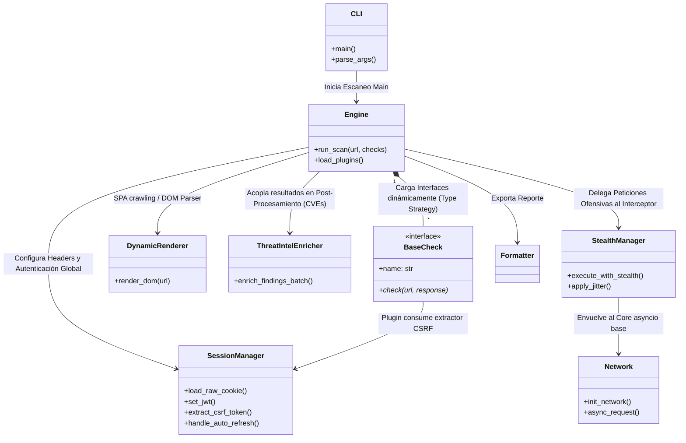

# WebVulnScanner

## Licencias


**Escáner de Vulnerabilidades Web Asíncrono y Modular**

WebVulnScanner es una herramienta avanzada de auditoría de seguridad diseñada para profesionales de ciberseguridad, pentesters y administradores de sistemas. Su objetivo es identificar fallos de seguridad comunes en aplicaciones web de manera rápida y eficiente utilizando un motor asíncrono de alto rendimiento.

## 🚀 Características Principales

- **Motor Asíncrono Absoluto**: Basado enteramente en `asyncio` y `aiohttp`, capaz de sostener y encolar cientos de peticiones sin agotar recursos.
- **Renderizado Dinámico de SPAs**: Integración nativa con `playwright` asíncrono para renderizar aplicaciones React, Vue o Angular de forma automatizada, aislando fugas de memoria y optimizando anchos de banda.
- **Evasión de WAF (Stealth Mode)**: Algoritmos de evasión y *bypass* de Rate Limits con Math Jitter (Ruido), Rotación biológica activa del User-Agent, y semáforos de Backoff exponencial anti-baneos permanentes.
- **Gestión Avanzada de Sesiones**: Administración global *Thread-Safe* con auto-refresh de tokens JWT, extracción dinámica de tokens CSRF y cookies persistentes desde áreas privadas de las web-apps.
- **Peritaje Threat Intelligence (CTI)**: Enriquecimiento automatizado en fase de post-procesamiento. Localiza vulnerabilidades subyacentes (CVEs) de tecnologías detectadas interactuando con bases públicas desde un motor local de concurrencia y caché.
- **Análisis Híbrido**: DAST (inyección en vivo) + SAST (estudio estático de fugas de secretos JS).
- **Reportes Enriquecidos**: Generación automática de reportes en JSON y Markdown, incluyendo severidades CVE.
- **Suite de Tests**: 95 pruebas unitarias e de integración con cobertura para componentes y módulos dinámicos.

## 🛠️ Instalación

Primero, clona el repositorio en tu máquina local:

```bash
git clone https://github.com/George230297/WebVulnScanner.git
cd WebVulnScanner
```

Luego, se recomienda instalar la herramienta en un entorno virtual:

```bash
python -m venv venv
# Activar entorno (Windows)
venv\Scripts\activate
# Activar entorno (Linux/Mac)
source venv/bin/activate

# Instalar dependencias (incluye playwright y otras utilidades)
pip install -r requirements.txt
playwright install chromium
```

> **Dependencias principales**: `aiohttp`, `playwright`, `beautifulsoup4`, `aiodns`  

## 💻 Uso

### Interfaz de Línea de Comandos (CLI)

```bash
# Auditar un objetivo limitando simultaneidad para evitar ban, ejecutando Stealth:
python run_scanner.py --url https://ejemplo.com --workers 50
```

Opciones disponibles:

- `--url`: URL objetivo (requerido).
- `--checks`: Lista de chequeos específicos (ej: `xss sqli`). Por defecto ejecuta todos.
- `--max-pages`: Límite de páginas a crawlear (default: 50).
- `--workers`: Número de hilos/conexiones concurrentes (default: 20).
- `--report`: Nombre del archivo de reporte (default: `report.json`).

### 📋 Ayuda y Comandos

| Argumento           | Descripción                                                   | Requerido |    Default    |
| :------------------ | :------------------------------------------------------------ | :-------: | :-----------: |
| `-h`, `--help`      | Muestra el mensaje de ayuda y termina.                        |    No     |       -       |
| `--url URL`         | URL objetivo para iniciar el escaneo.                         |  **Sí**   |       -       |
| `--checks [CHECKS]` | Lista de chequeos específicos a ejecutar (ej: `xss`, `sqli`). |    No     |     `all`     |
| `--max-pages N`     | Número máximo de páginas a visitar durante el crawling.       |    No     |     `50`      |
| `--workers N`       | Número de hilos/conexiones concurrentes.                      |    No     |     `20`      |
| `--report FILE`     | Nombre y ruta del archivo de reporte a generar.               |    No     | `report.json` |

## 🛡️ Capacidades de Detección

La versión actual incluye los siguientes plugins integrados:

1. **Reflected XSS**: Detección de Cross-Site Scripting reflejado mediante inyección y parseo.
2. **SQL Injection (Error-Based)**: Inyección y fuga SQL basada en errores base.
3. **Secrets Leak**: Búsqueda SAST de claves de AWS (`AKIA*`), Tokens, PEM privadas.
4. **Security Headers**: Auditoría analítica de cabeceras de respuesta (HSTS, CSP).
5. **Sensitive Files**: Descubrimiento de puntos expuestos. Combate falsos Soft 404s en implementaciones SPA.
6. **CSRF**: Inyección y evasión paralela de tokens *authenticity*.
7. **SSRF Candidates**: Forja de peticiones a nivel del lado del servidor.

## 📈 Mejoras Recientes (V2: Motor Arquitectónico)

Se ha realizado una actualización de arquitectura de base masiva para soportar evasión de Firewalls de un nivel militar:

- **Evasión WAF 'Stealth Mode' (`stealth.py`)**: El motor de red ahora implementa *Mathematical Jitter* aleatorio y domina un candado de contención Exponencial (Backoff) por subdominio que congela y reintenta las flotas de ataques si el API nos retorna bloqueos HTTP 429 / 403, evadiendo Hard Bans de WAFs perimetrales.
- **Identidad e Inyección de Sesiones Avanzadas (`session_manager.py`)**: El motor ahora rastrea tokens estáticos y dinámicos (JWT). Implementa algoritmos *Thread-Safe* para refrescar de forma atómica credenciales caducadas invocando Callbacks del usuario sin abortar el escaneo en las restantes tareas concurrentes.
- **Renderizado Adaptativo Anti-Zombie (`browser.py`)**: El escáner intercepta código renderizado desde `playwright` mediante un Context Manager robusto que asfixia peticiones de imágenes/CSS acelerando el escáner de React/VueX inmensamente y asegurando que las ramas Chromium en memoria mueran limpiamente.
- **Inteligencia Threat Intel (`threat_intel.py`)**: Post-procesamiento automatizado anti-estampidas. Consulta APIs conectables de CTI de forma asíncrona in-band apoyada por Cachés nativas que añaden CVEs directos a las versiones descubiertas (ej Apache 2.4 / Nginx).
- **Control Soft 404 Dinámico**: Creada abstracción heurística estricta usando MD5 body-hashing junto a tolerancias de longitud para descartar páginas falsas entregadas por Proxies 200 OK.

## 🏗️ Arquitectura y Diseño

El proyecto se sustenta en una arquitectura modular fundamentada en el **Patrón Strategy** inyectado a una batería de Middlewares base.

### Diagrama de Clases (UML)



### ¿Por qué se eligió el Patrón Strategy en conjunto con Middlewares?

Se seleccionó este patrón de diseño comportamental de manera intencional:
1. **Separación de Responsabilidades (SoC):** El motor se abstrae del ataque. Su única tarea es la concurrencia. Los Módulos de Núcleo (Stealth, Session, Browser) lo envuelven y blindan.
2. **Abierto a Extensión:** Modificar heurísticas o conectarse a nuevas bases de Threat Intel locales no demanda re-reescribir el motor central de HTTP (Network).

## ⚖️ Licencia

Este proyecto está licenciado bajo la **Licencia MIT**.

## ⚠️ DESCARGO DE RESPONSABILIDAD (DISCLAIMER)

Esta herramienta ha sido desarrollada **exclusivamente con fines educativos y de auditoría de seguridad autorizada**. WebVulnScanner ayuda a administradores y analistas a identificar fugas y errores operacionales propios. Su uso ilícito contra un patrimonio informático ajeno no autorizado penaliza severamente por la ley y **es responsabilidad unívoca del ejecutor directo**.
