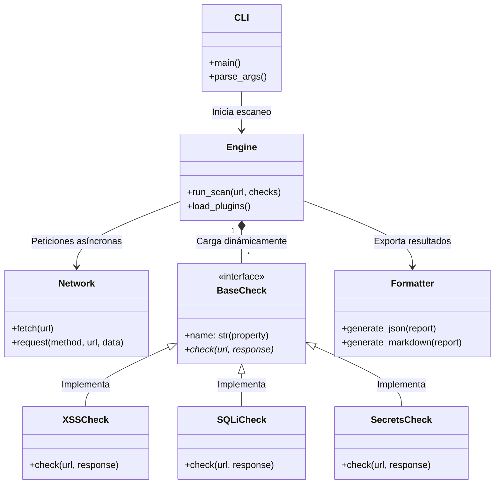

# WebVulnScanner

## Licencias


**Escáner de Vulnerabilidades Web Asíncrono y Modular**

WebVulnScanner es una herramienta avanzada de auditoría de seguridad diseñada para profesionales de ciberseguridad, pentesters y administradores de sistemas. Su objetivo es identificar fallos de seguridad comunes en aplicaciones web de manera rápida y eficiente utilizando un motor asíncrono de alto rendimiento.

## 🚀 Características Principales

- **Motor Asíncrono**: Basado en `asyncio` y `aiohttp`, capaz de realizar cientos de peticiones concurrentes sin bloquear el sistema.
- **Arquitectura Modular**: Sistema de plugins extensible. Añade nuevas detecciones sin modificar el núcleo.
- **Análisis Híbrido**:
  - **DAST (Dynamic Analysis)**: Inyección de payloads para XSS y SQLi en tiempo real.
  - **SAST (Static Analysis)**: Análisis de archivos JavaScript (`.js`) para detectar secretos hardcodeados (API Keys, Tokens) y endpoints ocultos.
- **Seguridad Mejorada**: Verificación robusta de SSL/TLS y validación estricta de regex para reducir falsos positivos.
- **Detección de WAF**: Identificación básica de Firewalls de Aplicación Web.
- **Reportes Enriquecidos**: Generación automática de reportes en JSON y Markdown, incluyendo `severity` y `timestamp` por hallazgo.
- **Interfaz Unificada**: Uso simplificado a través de un único punto de entrada CLI.
- **Suite de Tests**: 95 pruebas unitarias e de integración (`pytest`) que cubren todos los módulos del sistema.

## 🛠️ Instalación

Primero, clona el repositorio en tu máquina local:

```bash
git clone https://github.com/George230297/WebVulnScanner.git
cd WebVulnScanner
```

Luego, se recomienda instalar la herramienta en un entorno virtual:

```bash
# Crear entorno virtual
python -m venv venv
# Activar entorno (Windows)
venv\Scripts\activate
# Activar entorno (Linux/Mac)
source venv/bin/activate

# Instalar dependencias (incluye herramientas de testing)
pip install -r requirements.txt
```

> **Dependencias principales**: `aiohttp`, `aiodns`, `beautifulsoup4`, `chardet`  
> **Dependencias de testing**: `pytest>=7.4`, `pytest-asyncio>=0.23`

## 💻 Uso

### Interfaz de Línea de Comandos (CLI)

Para un escaneo rápido y directo utilice el script principal:

```bash
python run_scanner.py --url https://ejemplo.com --workers 50
```

Opciones disponibles:

- `--url`: URL objetivo (requerido).
- `--checks`: Lista de chequeos específicos (ej: `xss sqli`). Por defecto ejecuta todos.
- `--max-pages`: Límite de páginas a crawlear (default: 50).
- `--workers`: Número de hilos/conexiones concurrentes (default: 20).
- `--report`: Nombre del archivo de reporte (default: `report.json`).

### Ejemplo de uso modular

```bash
# Ejecutar solo checks de secretos y headers
python run_scanner.py --url https://target.com --checks secrets headers
```

### 📋 Ayuda y Comandos

A continuación se detalla la lista completa de argumentos disponibles y su función, tal como se obtiene al ejecutar `python run_scanner.py --help`:

| Argumento           | Descripción                                                   | Requerido |    Default    |
| :------------------ | :------------------------------------------------------------ | :-------: | :-----------: |
| `-h`, `--help`      | Muestra el mensaje de ayuda y termina.                        |    No     |       -       |
| `--url URL`         | URL objetivo para iniciar el escaneo.                         |  **Sí**   |       -       |
| `--checks [CHECKS]` | Lista de chequeos específicos a ejecutar (ej: `xss`, `sqli`). |    No     |     `all`     |
| `--max-pages N`     | Número máximo de páginas a visitar durante el crawling.       |    No     |     `50`      |
| `--workers N`       | Número de hilos/conexiones concurrentes.                      |    No     |     `20`      |
| `--report FILE`     | Nombre y ruta del archivo de reporte a generar.               |    No     | `report.json` |

## 🛡️ Capacidades de Detección

La versión actual incluye los siguientes módulos (plugins):

1.  **Reflected XSS**: Detección de Cross-Site Scripting reflejado mediante inyección de payloads y verificación de reflejo en la respuesta.
2.  **SQL Injection (Error-Based)**: Inyección SQL basada en errores de base de datos, con detección de mensajes de error comunes.
3.  **Secrets Leak**: Búsqueda de claves API (AWS `AKIA*`, Google `AIza*`, Slack, tokens genéricos, claves privadas PEM) en código fuente y JS.
4.  **Security Headers**: Auditoría de cabeceras de seguridad faltantes (HSTS, CSP, X-Frame-Options, X-Content-Type-Options).
5.  **Sensitive Files**: Detección de archivos expuestos (`.env`, `.git/HEAD`, backups, etc.).
6.  **CSRF**: Análisis heurístico de formularios sin tokens anti-CSRF. Reconoce patrones: `csrf`, `token`, `nonce`, `_token`, `authenticity_token`.
7.  **SSRF Candidates**: Identificación de parámetros sospechosos de Server-Side Request Forgery mediante match exacto y por substring (ej. `redirect_url` → detecta `redirect`).

## 🧪 Testing

El proyecto cuenta con una suite completa de **95 pruebas** organizadas en dos niveles:

```
tests/
├── conftest.py                      # Fixtures compartidas (mocks de red)
├── unit/
│   ├── test_vulnerability_model.py  # Modelo de datos
│   ├── test_config.py               # Configuración y regex patterns
│   ├── test_plugins_xss.py          # Plugin XSS
│   ├── test_plugins_sqli.py         # Plugin SQLi
│   ├── test_plugins_secrets.py      # Plugin Secrets
│   ├── test_plugins_headers.py      # Plugin Headers
│   ├── test_plugins_csrf.py         # Plugin CSRF
│   ├── test_plugins_ssrf.py         # Plugin SSRF
│   ├── test_decorators.py           # Decoradores (audit_log, retry_network)
│   └── test_formatter.py            # Generación de reportes
└── integration/
    └── test_plugin_loader.py        # Carga dinámica de plugins
```

### Ejecutar los tests

```bash
# Todos los tests
pytest tests/ -v

# Solo unitarios
pytest tests/unit/ -v

# Solo integración
pytest tests/integration/ -v
```

> **Nota**: Los tests de plugins no realizan peticiones HTTP reales. Toda la capa de red es mockeada mediante `unittest.mock.AsyncMock`.

## 📊 Schema del Reporte JSON

El reporte generado (`report.json`) sigue la siguiente estructura:

```json
{
  "meta": {
    "target": "https://ejemplo.com",
    "scanner": "WebVulnScanner v2_modular",
    "timestamp": "2026-03-13T21:00:00+00:00"
  },
  "crawl": {
    "pages_count": 12,
    "js_files_scanned": ["https://ejemplo.com/app.js"]
  },
  "checks": {
    "xss": [
      {
        "type": "Reflected XSS",
        "url": "https://ejemplo.com/search",
        "param": "q",
        "evidence": "<script>alert(1)</script>",
        "severity": "High"
      }
    ]
  }
}
```

> Los campos `severity` y `timestamp` fueron añadidos en la versión actual para enriquecer los reportes de auditoría.

## 📈 Mejoras Recientes (Refactoring & Bug Fixes)

Se ha realizado una actualización completa del código base para alinearlo con las mejores prácticas de ingeniería de software y patrones de diseño modernos:

- **Refactorización Asíncrona Robusta**: El núcleo (`engine.py` y `network.py`) ahora maneja nativamente las excepciones de red (timeouts, caídas de servidor) usando `aiohttp` y `asyncio`, sin interrumpir el escaneo.
- **Patrón Strategy (Plugins Dinámicos)**: Los plugins de vulnerabilidades fueron desacoplados. El motor carga módulos de forma autónoma usando `importlib` y `pkgutil`. Para agregar detecciones, solo es necesario heredar de `BaseCheck`.
- **Contrato de Plugins corregido**: Todos los plugins implementan `name` como `@property` abstracta, garantizando el cumplimiento del contrato de `BaseCheck`.
- **Separación de Responsabilidades (SoC)**:
  - **Manejo de Payloads**: Los payloads se cargan desde archivos dedicados (`payloads/sqli.txt`, `payloads/xss.txt`).
  - **Reporting Centralizado**: La lógica JSON/Markdown se centraliza en `reporting/formatter.py`.
- **Gestión Avanzada de Payloads**: La reconstrucción de peticiones (`urlencode`/`urlunparse`) se hace manualmente, previniendo que clientes HTTP sobre-codifiquen caracteres críticos (ej. `1'`).
- **Strict Type Hinting**: Tipado estricto a lo largo de todo el código usando `typing`.
- **Auditoría de Red**: Sistema de reintentos (`@retry_network`) y logging centralizado de auditoría (`@audit_log`).
- **Concurrencia corregida**: La tarea en background `check_sensitive_files` ahora se trackea y se awaita correctamente antes de generar el reporte.
- **Regex sin falsos positivos**: Eliminada la regex genérica de AWS Keys que producía falsos positivos masivos; reemplazada por el patrón de prefijo `AKIA` de alta precisión.
- **Deduplicación de plugins**: El loader garantiza que no se registren clases duplicadas aunque un módulo re-importe clases de otro.
- **Reportes enriquecidos**: El JSON de output ahora incluye campos `severity` y `timestamp` para cada hallazgo.

## 🏗️ Arquitectura y Diseño

El proyecto se sustenta en una arquitectura modular fundamentada en el **Patrón Strategy**, lo que permite una detección dinámica de vulnerabilidades con un núcleo asíncrono.

### Diagrama de Clases (UML)



### ¿Por qué se eligió el Patrón Strategy?

Se seleccionó este patrón de diseño comportamental de manera intencional para separar y encapsular los algoritmos de detección:

1. **Cumplimiento del Principio Abierto/Cerrado (OCP):** Nuevas técnicas de inyección y escaneo (como _LFI_ o _SSRF avanzado_) pueden ser integradas implementando la interfaz `BaseCheck` como un plugin nuevo. El motor las carga de forma automática en runtime sin modificar ni una sola línea de código del core.
2. **Separación de Responsabilidades (SoC):** El motor se abstrae completamente del tipo de vulnerabilidades. Su única responsabilidad recae en asegurar concurrencia masiva, persistencia de sesión estricta y balanceo de red, delegando la heurística al plugin.
3. **Mantenibilidad:** Erradica el código espagueti y los extensos diccionarios de condicionales. Cada vulnerabilidad está en cuarentena en su propia clase probada de forma unitaria con tests independientes.

## ⚖️ Licencia

Este proyecto está licenciado bajo la **Licencia MIT**.

```text
MIT License

Copyright (c) 2026 [Tu Nombre / Organización]

Permission is hereby granted, free of charge, to any person obtaining a copy
of this software and associated documentation files (the "Software"), to deal
in the Software without restriction, including without limitation the rights
to use, copy, modify, merge, publish, distribute, sublicense, and/or sell
copies of the Software, and to permit persons to whom the Software is
furnished to do so, subject to the following conditions:

The above copyright notice and this permission notice shall be included in all
copies or substantial portions of the Software.

THE SOFTWARE IS PROVIDED "AS IS", WITHOUT WARRANTY OF ANY KIND, EXPRESS OR
IMPLIED, INCLUDING BUT NOT LIMITED TO THE WARRANTIES OF MERCHANTABILITY,
FITNESS FOR A PARTICULAR PURPOSE AND NONINFRINGEMENT. IN NO EVENT SHALL THE
AUTHORS OR COPYRIGHT HOLDERS BE LIABLE FOR ANY CLAIM, DAMAGES OR OTHER
LIABILITY, WHETHER IN AN ACTION OF CONTRACT, TORT OR OTHERWISE, ARISING FROM,
OUT OF OR IN CONNECTION WITH THE SOFTWARE OR THE USE OR OTHER DEALINGS IN THE
SOFTWARE.
```

## ⚠️ DESCARGO DE RESPONSABILIDAD (DISCLAIMER)

**LEER ATENTAMENTE ANTES DE USAR:**

Esta herramienta ha sido desarrollada **exclusivamente con fines educativos y de auditoría de seguridad autorizada**. El objetivo de WebVulnScanner es ayudar a administradores y desarrolladores a identificar y corregir vulnerabilidades en sus propios sistemas.

- **Uso No Autorizado**: El uso de esta herramienta contra objetivos o infraestructuras sin el consentimiento previo, explícito y por escrito de sus propietarios es **ILEGAL** y está estrictamente prohibido.
- **Responsabilidad**: El autor y los contribuidores de este proyecto **NO se hacen responsables** de ningún mal uso, daño, pérdida de datos o consecuencias legales derivadas de la utilización de esta herramienta.
- **Bajo su propio riesgo**: El usuario asume toda la responsabilidad por las acciones realizadas con este software.

**Si no estás seguro de tener permiso para escanear un sitio web, NO LO HAGAS.**
